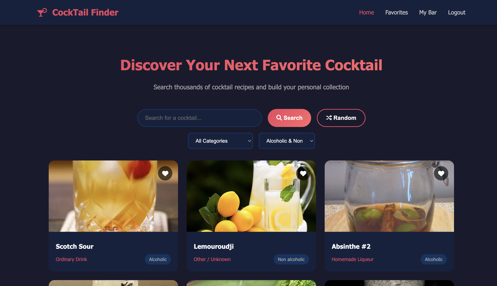
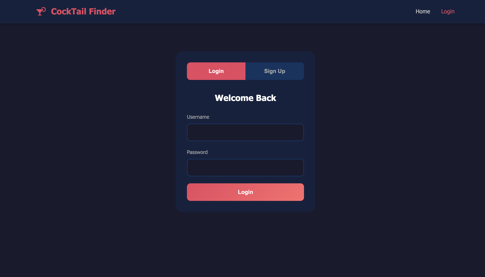
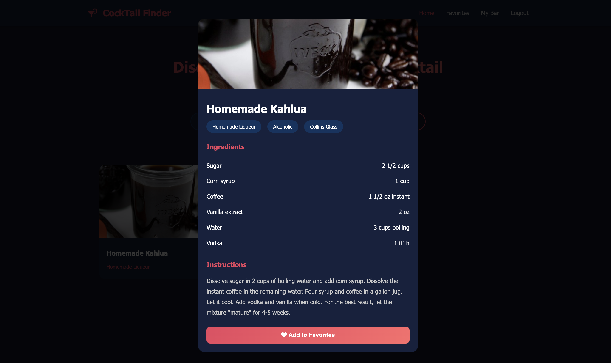
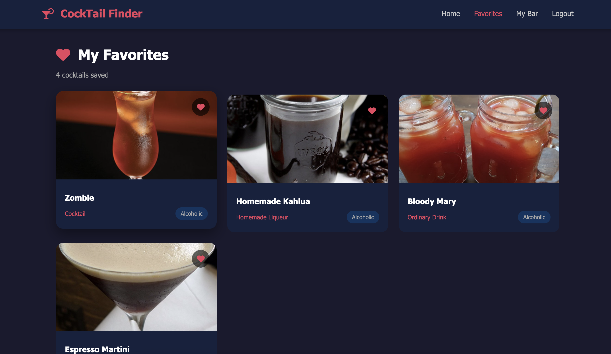
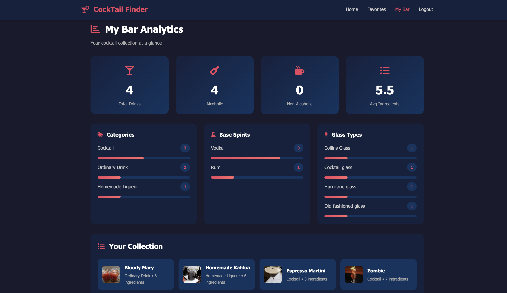

# 🍹 Find Your Cocktail!

A full-stack web application for discovering, searching, and saving cocktail recipes. Built with Java Servlets, MySQL, and vanilla JavaScript, integrating with TheCocktailDB API.

---

## 📋 Table of Contents

- [Features](#-features)
- [Tech Stack](#-tech-stack)
- [Architecture](#-architecture)
- [Getting Started](#-getting-started)
- [API Endpoints](#-api-endpoints)
- [Database Schema](#-database-schema)
- [Project Structure](#-project-structure)
- [Screenshots](#-screenshots)

---

## ✨ Features

### 🔍 Search & Discovery
- Search cocktails by name with real-time results
- Filter by category (Cocktail, Shot, Beer, etc.)
- Filter by alcoholic/non-alcoholic options
- Random cocktail generator for inspiration

### 👤 User Authentication
- Secure user registration and login
- Session management with HTTP cookies
- Password-protected accounts

### ❤️ Favorites System
- Save favorite cocktails to personal collection
- View saved drinks with full details
- One-click add/remove from any page

### 📊 My Bar Analytics Dashboard
- Total drinks in collection
- Alcoholic vs non-alcoholic breakdown
- Average ingredient count
- Category distribution analysis
- Base spirit breakdown (Vodka, Gin, Rum, etc.)
- Glass type variety tracking

### 🍸 Cocktail Details
- High-quality drink images
- Complete ingredient lists with measurements
- Step-by-step mixing instructions
- Glass type recommendations
- Category and alcohol content info

---

## 🛠 Tech Stack

### Backend
| Technology | Purpose |
|------------|---------|
| **Java 17+** | Core programming language |
| **Jakarta Servlets** | HTTP request handling |
| **Gson** | JSON parsing and serialization |
| **MySQL 8.0** | Relational database |
| **JDBC** | Database connectivity |
| **Apache Tomcat 10** | Application server |

### Frontend
| Technology | Purpose |
|------------|---------|
| **HTML5** | Page structure |
| **CSS3** | Styling and responsive design |
| **JavaScript (ES6+)** | Dynamic interactions |
| **Font Awesome** | Icons |

### External API
| API | Purpose |
|-----|---------|
| **TheCocktailDB** | Cocktail data, images, and recipes |

---

## 🏗 Architecture

```
┌─────────────────────────────────────────────────────────────┐
│                        FRONTEND                              │
│              HTML / CSS / JavaScript                         │
│    ┌──────────┬──────────┬──────────┬──────────┐           │
│    │  index   │  login   │favorites │  mybar   │           │
│    └────┬─────┴────┬─────┴────┬─────┴────┬─────┘           │
└─────────┼──────────┼──────────┼──────────┼──────────────────┘
          │          │          │          │
          ▼          ▼          ▼          ▼
┌─────────────────────────────────────────────────────────────┐
│                    JAVA SERVLETS                             │
│    ┌──────────┬──────────┬──────────┬──────────┐           │
│    │  Login   │ Register │Favorites │  MyBar   │           │
│    │ Servlet  │ Servlet  │ Servlet  │ Servlet  │           │
│    └────┬─────┴────┬─────┴────┬─────┴────┬─────┘           │
└─────────┼──────────┴──────────┴──────────┼──────────────────┘
          │                                │
          ▼                                ▼
┌─────────────────────┐    ┌─────────────────────────────────┐
│       MySQL         │    │       TheCocktailDB API         │
│    ┌─────────┐      │    │                                 │
│    │  users  │      │    │  • Search cocktails             │
│    ├─────────┤      │    │  • Get drink details            │
│    │favorites│      │    │  • Filter by category           │
│    └─────────┘      │    │  • Random drinks                │
└─────────────────────┘    └─────────────────────────────────┘
```

---

## 🚀 Getting Started

### Prerequisites

- **Java JDK 17+** — [Download](https://adoptium.net/)
- **Apache Tomcat 10+** — [Download](https://tomcat.apache.org/download-10.cgi)
- **MySQL 8.0+** — [Download](https://dev.mysql.com/downloads/)
- **Maven** — [Download](https://maven.apache.org/download.cgi)
- **IDE** — IntelliJ IDEA recommended

### Installation

#### 1. Clone the repository

```bash
git clone https://github.com/jihansol1/cocktail.git
cd cocktail
```

#### 2. Set up the database

```sql
CREATE DATABASE cocktail;
USE cocktail;

CREATE TABLE users (
    user_id INT AUTO_INCREMENT PRIMARY KEY,
    username VARCHAR(50) NOT NULL UNIQUE,
    email VARCHAR(100) NOT NULL UNIQUE,
    password VARCHAR(255) NOT NULL,
    created_at TIMESTAMP DEFAULT CURRENT_TIMESTAMP
);

CREATE TABLE favorites (
    favorite_id INT AUTO_INCREMENT PRIMARY KEY,
    user_id INT NOT NULL,
    drink_id VARCHAR(20) NOT NULL,
    drink_name VARCHAR(200) NOT NULL,
    drink_category VARCHAR(100),
    drink_image VARCHAR(500),
    glass_type VARCHAR(100),
    is_alcoholic VARCHAR(20),
    ingredient_count INT,
    base_spirit VARCHAR(100),
    created_at TIMESTAMP DEFAULT CURRENT_TIMESTAMP,
    FOREIGN KEY (user_id) REFERENCES users(user_id) ON DELETE CASCADE,
    UNIQUE KEY unique_user_drink (user_id, drink_id)
);
```

#### 3. Configure database connection

Create `src/main/resources/db.properties`:

```properties
db.url=jdbc:mysql://localhost:3306/cocktail
db.user=root
db.password=YOUR_PASSWORD_HERE
```

> ⚠️ **Note:** Never commit `db.properties` to version control. Add it to `.gitignore`.

#### 4. Build the project

```bash
mvn clean package
```

#### 5. Deploy to Tomcat

- Copy `target/cocktail-1.0-SNAPSHOT.war` to Tomcat's `webapps/` folder
- Or configure Tomcat in your IDE

#### 6. Run the application

- Start Tomcat
- Open `http://localhost:8080/cocktail_war_exploded/`

---

## 📡 API Endpoints

### Authentication

| Method | Endpoint | Description | Request Body |
|--------|----------|-------------|--------------|
| POST | `/login` | User login | `{ "username": "", "password": "" }` |
| POST | `/register` | User registration | `{ "username": "", "email": "", "password": "" }` |

### Favorites

| Method | Endpoint | Description | Parameters |
|--------|----------|-------------|------------|
| GET | `/favorites` | Get user's favorites | `userId` |
| POST | `/favorites` | Add to favorites | JSON body with drink details |
| DELETE | `/favorites` | Remove from favorites | `userId`, `drinkId` |

### Analytics

| Method | Endpoint | Description | Parameters |
|--------|----------|-------------|------------|
| GET | `/mybar` | Get user analytics | `userId` |

### Response Format

All endpoints return JSON:

```json
{
  "success": true,
  "message": "Operation completed",
  "data": { }
}
```

---

## 🗄 Database Schema

### Entity Relationship Diagram

```
┌─────────────────┐         ┌─────────────────────┐
│     users       │         │      favorites      │
├─────────────────┤         ├─────────────────────┤
│ PK user_id      │────────<│ FK user_id          │
│    username     │         │ PK favorite_id      │
│    email        │         │    drink_id         │
│    password     │         │    drink_name       │
│    created_at   │         │    drink_category   │
└─────────────────┘         │    drink_image      │
                            │    glass_type       │
                            │    is_alcoholic     │
                            │    ingredient_count │
                            │    base_spirit      │
                            │    created_at       │
                            └─────────────────────┘
```

---

## 📁 Project Structure

```
MixMaster/
├── src/
│   └── main/
│       ├── java/
│       │   └── com/
│       │       └── cocktail/
│       │           ├── database/
│       │           │   └── JDBCConnector.java
│       │           └── servlets/
│       │               ├── LoginServlet.java
│       │               ├── RegisterServlet.java
│       │               ├── FavoritesServlet.java
│       │               └── MyBarServlet.java
│       │
│       ├── resources/
│       │   └── db.properties
│       │
│       └── webapp/
│           ├── WEB-INF/
│           │   └── web.xml
│           ├── index.html
│           ├── login.html
│           ├── favorites.html
│           ├── mybar.html
│           ├── css/
│           │   └── styles.css
│           └── js/
│               ├── index.js
│               ├── login.js
│               ├── favorites.js
│               └── mybar.js
│
├── pom.xml
├── setup.sql
├── .gitignore
└── README.md
```

---

## 📸 Screenshots

### Home Page — Search & Discovery
*Search cocktails, filter by category, and discover random drinks*



### Login Page — Login in or Register
*Securely register a new account or log in to your existing one*



### Cocktail Details Modal
*View ingredients, measurements, and mixing instructions*



### Favorites Page
*Your personal cocktail collection*



### My Bar Analytics
*Insights into your cocktail preferences*



---


## 🙏 Acknowledgments

- [TheCocktailDB](https://www.thecocktaildb.com/) for the free cocktail API
- [Font Awesome](https://fontawesome.com/) for icons
- [Google Fonts](https://fonts.google.com/) for typography

---

